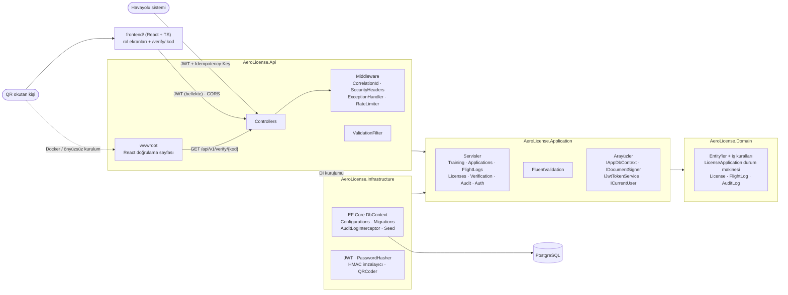
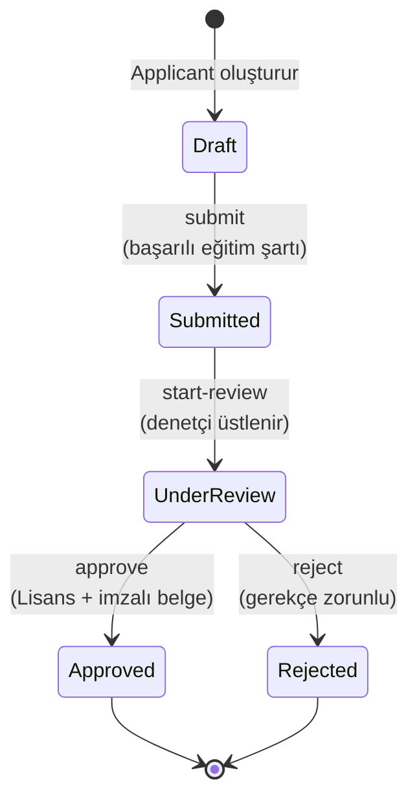
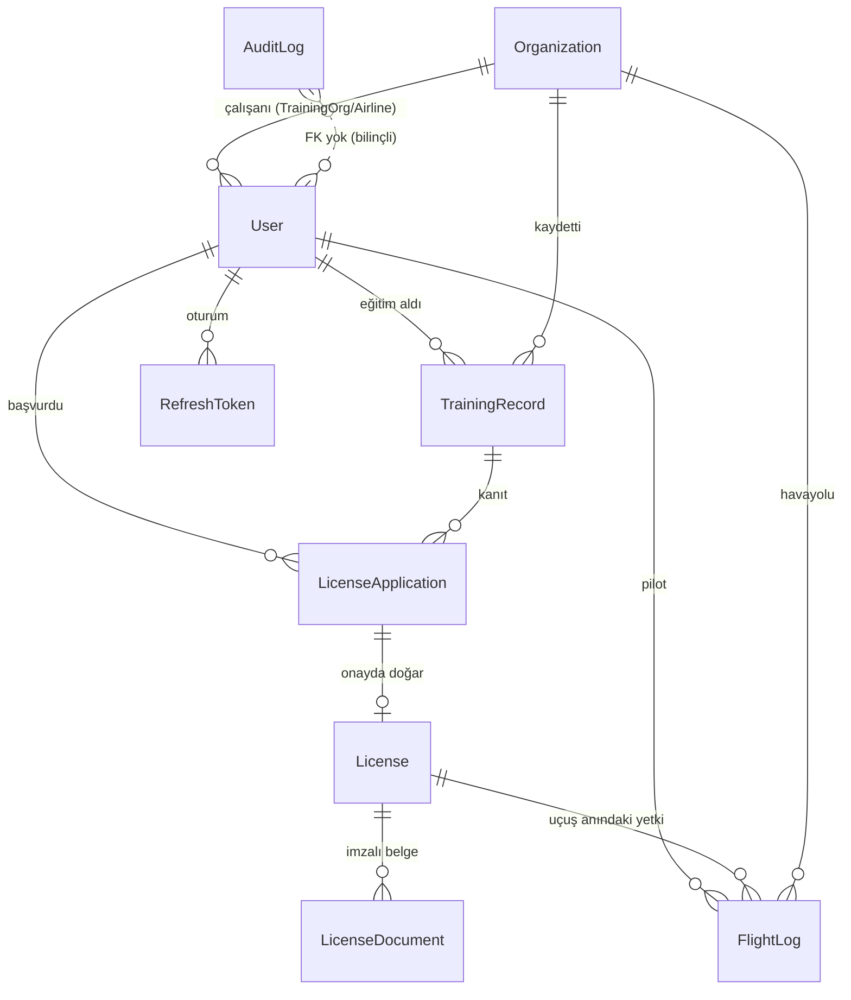

# AeroLicense

Kurgusal bir **Sivil Havacılık Otoritesi** için "eğitim → lisans başvurusu → onay → doğrulanabilir belge"
sürecini ve havayollarından gelen uçuş kayıtlarını dijitalleştiren, üretim kalitesini hedefleyen küçük bir prototip.

> **Önyüz:** React + TypeScript istemcisi [`frontend/`](frontend/README.md) klasöründe (rol bazlı ekranlar, QR doğrulama sayfası).

### 🚀 Canlı demo

**https://aerolicense-web.onrender.com** · Parola: `Demo123!` · Örnek hesaplar: `inspector@aerolicense.test`,
`pilot1@aerolicense.test`, `egitim1@aerolicense.test` (tümü: [Test kullanıcıları](#test-kullanıcıları))

> Ücretsiz sunucuda çalışır: bir süre kullanılmayınca uyur, **ilk açılış ~1 dakika** sürebilir. Giriş hata verirse
> bekleyip tekrar deneyin. Demo veritabanı herkese ortaktır; yaptığınız değişiklikleri başkaları da görebilir.

<!-- Ekran görüntüleri: docs/screenshots/ klasörüne ekleyip aşağıdaki satırları açın.
| Başvuru akışı | Denetçi onayı | QR doğrulama |
|---|---|---|
|  |  |  |
-->

> Tüm kurum, kişi, lisans ve uçuş verileri **kurgusaldır**. E-postalar IANA'nın test için ayırdığı `.test`
> alan adında, kimlik numaraları `99999…` ile başlar. Havalimanı kodları gerçek ICAO formatındadır ama uçuşlar uydurmadır.

---

## 1. Problem ve kapsam

| Süreç | Bugün (varsayım) | Prototipte |
|---|---|---|
| Eğitim sonucu | Kuruluş kâğıt/PDF gönderir | Yetkili eğitim kuruluşu API ile kaydeder; 70 altı "başarılı" sayılmaz |
| Lisans başvurusu | Dilekçe + manuel kontrol | Durum makinesiyle iş akışı; başarılı eğitim şartı otomatik kontrol edilir |
| Onay | Islak imza | Denetçi onayı; lisans ve imzalı belge aynı işlemde oluşur |
| Belge doğrulama | Telefonla teyit | QR → herkese açık doğrulama sayfası (geçerli / süresi dolmuş / iptal / değiştirilmiş) |
| Uçuş kayıtları | Havayolu periyodik rapor | Sistemden sisteme API; idempotent, rate limitli, çakışma kontrollü |
| İz kaydı | Dağınık | Değiştirilemez audit log + correlation ID ile log eşleştirme |

**Kapsam dışı (bilinçli):** gerçek kimlik doğrulama (e-Devlet), e-imza, sağlık sertifikası, lisans yenileme,
bildirim (e-posta/SMS), yönetim arayüzü. Bkz. [Ölçeklenirse ne yapardım](#6-ölçeklenirse-ne-yapardım).

### Roller

| Rol | Kim | Ne yapabilir |
|---|---|---|
| `Applicant` | Başvuru sahibi / pilot | Başvuru oluşturur ve gönderir; kendi eğitimlerini, lisanslarını, QR'ını, uçuş özetini görür |
| `TrainingOrg` | Yetkili eğitim kuruluşu | Eğitim ve sınav sonucu kaydeder; sadece kendi kayıtlarını görür |
| `Airline` | Havayolu (sistem entegrasyonu) | Uçuş kaydı gönderir |
| `Inspector` | Otorite denetçisi | Başvuruyu inceler, onaylar/reddeder; lisans iptal eder; audit log'u görür |
| Public | Girişsiz herkes | Sadece belge doğrular |

---

## 2. Mimari

Katmanlı / Clean Architecture. Bağımlılıklar yalnızca içe doğru: **Domain hiçbir şeye bağlı değil**.



QR'daki adres `Verification:PublicBaseUrl` ayarından gelir: geliştirmede önyüzün `http://localhost:5173/verify/`
sayfası, Docker kurulumunda (önyüz konteynerde olmadığı için) API'nin kendi `/dogrula/{kod}` sayfası.

| Proje | İçerik |
|---|---|
| `AeroLicense.Domain` | Entity'ler, enum'lar, iş kuralları. Setter'lar private; durum sadece metotlarla değişir |
| `AeroLicense.Application` | Servisler, DTO'lar, validator'lar, altyapı arayüzleri |
| `AeroLicense.Infrastructure` | EF Core + PostgreSQL, migration'lar, JWT, parola hash, HMAC imza, QR, seed |
| `AeroLicense.Api` | Controller'lar, middleware'ler, DI, rate limit, Swagger, doğrulama sayfası |
| `AeroLicense.Tests` | Birim testleri (SQLite in-memory) + integration testleri (gerçek PostgreSQL) |
| `frontend/` | React + TypeScript önyüz; API tipleri Swagger şemasından üretilir (bkz. [frontend/README.md](frontend/README.md)) |

**Repository katmanı neden yok?** `DbContext` zaten Unit of Work, `DbSet` zaten repository. Uygulama katmanı
`IAppDbContext` arayüzünü görür; testlerde SQLite in-memory ile **gerçek SQL** çalışır. Generic repository,
EF'in LINQ gücünü (projection, `ExecuteUpdate`) gizleyip kod eklemekten öteye geçmezdi.

### Lisans başvurusu durum diyagramı



Geçişler `LicenseApplication.AllowedTransitions` tablosunda tanımlı. `Draft → Approved` gibi bir geçiş
servis katmanında değil **domain'de** reddedilir (422). Karar sadece incelemeyi üstlenen denetçi tarafından
verilebilir; eşzamanlı iki karar `Version` concurrency token'ı ile 409'a düşer.

### Veri modeli



---

## 3. Kurulum

### Docker Compose (önerilen)

```bash
cp .env.example .env
# .env içinde: POSTGRES_PASSWORD, JWT_SIGNING_KEY ve DOCUMENT_SIGNING_KEY (ikisi FARKLI, en az 32 karakter)
#   openssl rand -base64 48
docker compose up --build
```

- API + Swagger: http://localhost:8080/swagger
- Önyüz: `cd frontend && npm install && npm run dev` → http://localhost:5173 (bkz. [frontend/README.md](frontend/README.md))
- Doğrulama sayfası: http://localhost:8080/dogrula/{kod}
- Health check: http://localhost:8080/health

Açılışta migration'lar uygulanır ve seed verisi yüklenir (sadece `Development` ortamında açık).

### Yerel geliştirme (Docker'sız)

```bash
cd src/AeroLicense.Api
dotnet user-secrets set "ConnectionStrings:Default" "Host=localhost;Port=5432;Database=aerolicense;Username=postgres;Password=..."
dotnet user-secrets set "Jwt:SigningKey" "$(openssl rand -base64 48)"
dotnet user-secrets set "DocumentSigning:Key" "$(openssl rand -base64 48)"
dotnet user-secrets set "Seed:DemoPassword" "Demo123!"
dotnet run --launch-profile http        # http://localhost:5272/swagger
```

Önyüz (Node.js 22 LTS gerekir), ayrı bir terminalde:

```bash
cd frontend
npm install
npm run dev                             # http://localhost:5173
```

Geliştirmede backend CORS'u **sadece** `http://localhost:5173` origin'ine izin verir ve QR adresleri
`http://localhost:5173/verify/` olur (`appsettings.Development.json`). 5173 başka bir uygulama tarafından
kullanılıyorsa, dosya değiştirmeden ikisini de ortam değişkeniyle başka bir porta taşıyın:

```bash
Cors__AllowedOrigins__0=http://localhost:5174 Verification__PublicBaseUrl=http://localhost:5174/verify/ \
  dotnet run --project src/AeroLicense.Api --launch-profile http
cd frontend && npx vite --port 5174 --strictPort
```

### Bulutta yayın (Render)

Kök dizindeki [`render.yaml`](render.yaml) üç servisi tanımlar: ücretsiz PostgreSQL, Docker ile .NET API ve
statik React önyüzü. Render → **New → Blueprint** → bu repo seçilir; JWT ve belge imzalama anahtarlarını Render
rastgele üretir, migration ve seed açılışta çalışır. Barındırma servislerinin verdiği `postgresql://` adresi
uygulama açılışında Npgsql biçimine çevrilir (`ConnectionStrings.Normalize`).

Servis adları Render'da benzersizdir; ad değişirse `render.yaml` içindeki CORS, doğrulama adresi ve
`VITE_API_BASE_URL` değerleri de güncellenmelidir.

### Testler

```bash
dotnet test                                             # birim testleri; integration testleri Docker yoksa "atlandı"
AEROLICENSE_IT_POSTGRES="Host=localhost;Port=5432;Username=postgres;Password=..." dotnet test
                                                        # integration: bu sunucuda geçici DB açılır, sonunda silinir
```

Docker erişilebiliyorsa integration testleri ortam değişkeni olmadan da **Testcontainers** ile
`postgres:16-alpine` başlatarak çalışır.

```bash
cd frontend
npm test                                                # önyüz bileşen testleri (MSW, backend gerekmez)
SMOKE_PASSWORD='Demo123!' npm run test:smoke            # gerçek backend'e karşı uçtan uca akış
```

Smoke testleri 5'ten fazla giriş yapar; backend'i `RateLimiting__LoginPermitPerMinute=100` ile başlatın.
Testler veritabanını değiştirir: temiz demo için veritabanını silip API'yi yeniden başlatın (seed yeniden kurulur).

### Test kullanıcıları

Parola: `.env` içindeki `SEED_DEMO_PASSWORD` (örnekte `Demo123!`).

| E-posta | Rol | Senaryo |
|---|---|---|
| `inspector@aerolicense.test` | Inspector | Başvuruları inceler, lisans iptal eder, audit görür |
| `egitim1@aerolicense.test` | TrainingOrg | Anadolu Uçuş Akademisi (Demo) |
| `egitim2@aerolicense.test` | TrainingOrg | Gökyüzü Pilot Okulu (Demo) |
| `havayolu1@aerolicense.test` | Airline | Demo Hava Yolları (`XDA`) |
| `havayolu2@aerolicense.test` | Airline | Kurgu Air (`XDB`) |
| `pilot1@aerolicense.test` | Applicant | Geçerli PPL; başarılı CPL eğitimi + **taslak CPL başvurusu** (canlı demo için) |
| `pilot2@aerolicense.test` | Applicant | Geçerli CPL; önce başarısız sonra başarılı sınav |
| `pilot3@aerolicense.test` | Applicant | **Süresi dolmuş** PPL; başarısız ATPL eğitimi (başvuru reddedilir) |

Seed'de iki **şüpheli uçuş** bulunur (denetçi → Uçuş kayıtları → "Sadece şüpheli kayıtlar"): 13 saatlik `XDB11`
(uzun süre) ve inişten 45 gün sonra bildirilmiş `XDA150` (geç bildirim).

### Endpoint'ler (hepsi `/api/v1`)

| Metot | Yol | Rol | Not |
|---|---|---|---|
| POST | `/auth/login` | Girişsiz | IP başına 5/dk (`RateLimiting:LoginPermitPerMinute`) |
| POST | `/auth/refresh` · `/auth/logout` | Girişsiz | Refresh token rotation |
| GET | `/auth/me` | Giriş yapmış | Kimlik, rol, ad, kuruluş |
| POST / GET | `/training-records` | TrainingOrg / + Applicant, Inspector | Sayfalı, kayıt düzeyinde yetki |
| POST | `/license-applications` | Applicant | Taslak oluşturur |
| GET | `/license-applications[/{id}]` | Applicant, Inspector | `status`, `sortBy` (CreatedAt/SubmittedAt), `sortDir` |
| POST | `/license-applications/{id}/submit` | Applicant | |
| POST | `/license-applications/{id}/start-review` · `/approve` · `/reject` | Inspector | |
| GET | `/licenses` · `/licenses/{id}/qr` | Applicant, Inspector | QR = PNG |
| POST | `/licenses/{id}/revoke` | Inspector | |
| POST | `/flight-logs` | Airline | `Idempotency-Key` zorunlu, havayolu başına 60/dk |
| GET | `/flight-logs` | Airline (kendi), Inspector | `suspicious=true`: süre ≥ 12 sa veya 30+ gün geç bildirim; pilot adı sadece denetçiye |
| GET | `/pilots/{id}/summary` | Applicant (kendisi), Inspector | Toplam / 30 gün / 90 gün |
| GET | `/verify/{code}` | **Girişsiz** | IP başına 30/dk, `no-store` |
| GET | `/audit-logs` | Inspector | Filtre: entityType, entityId, actorUserId, action, from/to |

Hızlı demo (önyüzden): `pilot1` ile giriş → Başvurularım → CPL taslağı → **Gönder** → `inspector` ile
İnceleme kuyruğu → **İncelemeye al** → **Onayla** → `pilot1` ile **Lisans belgem** → QR altındaki doğrulama
adresini aç → "Geçerli". Aynı akış API'den: `GET /license-applications?status=Draft` → `submit` →
`start-review` + `approve` → `GET /licenses` → `verificationUrl`.

---

## 4. Güvenlik

| Başlık | Projede ne yapıldı |
|---|---|
| **Girdi doğrulama** | Her request DTO'su için FluentValidation validator'ı; global `ValidationFilter` bunları otomatik çalıştırır, yani bir endpoint'te validasyonu unutmak mümkün değil. Sıkı formatlar kullanılıyor (ICAO `^[A-Z]{4}$`, TC kimlik no, uçuş no) ve UTC olmayan zaman reddediliyor. Kurallar domain'de tekrar kontrol ediliyor, kritik olanlar da veritabanında `CHECK` constraint olarak duruyor. Tüm uzunluklara üst sınır konmuş; parola için de var, böylece çok uzun parolayla hash fonksiyonunu yorma saldırısı yapılamıyor. Sayfalamada `pageSize ≤ 100`. |
| **Kimlik doğrulama** | 15 dakikalık JWT access token + 7 günlük refresh token. Refresh token'larda rotation ve **tekrar kullanım tespiti** var: çalınan bir token kullanılırsa o oturumun tüm token ailesi iptal ediliyor. Doğrulamada `alg` sabit (HS256), issuer/audience/lifetime kontrol ediliyor, `ClockSkew` 30 saniye. Login'de kullanıcı yoksa da parola hash'i hesaplanıyor; hem hata mesajı hem yanıt süresi kayıtlı e-postayı ele vermiyor (user enumeration). Login'e IP başına rate limit var. |
| **Yetkilendirme** | Varsayılan olarak her şey kapalı: fallback policy tüm endpoint'lerde giriş istiyor, açık olanlar `[AllowAnonymous]` ile tek tek işaretli. Rol kontrolü `[Authorize(Roles=…)]` ile yapılıyor. Bunun yanında **kayıt düzeyinde yetki** var: pilot sadece kendi verisini, eğitim kuruluşu sadece kendi kayıtlarını görüyor. Başkasının kaydına erişim denemesi 403 değil 404 dönüyor, böylece kaydın var olup olmadığı da sızmıyor. |
| **Parametre manipülasyonu** | Kimlik bilgisi (kullanıcı, kuruluş, havayolu) **asla** request body'den alınmıyor, sadece token'dan okunuyor (`ICurrentUser`). IDOR testleri var (`?applicantId=başkası` denemesi). Durum geçişleri ayrı eylem endpoint'leriyle yapılıyor; `PATCH status=Approved` gibi bir şey mümkün değil. Idempotency anahtarı gövdenin SHA-256 özetiyle bağlı: aynı anahtarla farklı içerik gönderilirse 422. |
| **Yapılandırma yönetimi** | Sırlar appsettings'te **yok**: ortam değişkeni, user-secrets ya da `.env` üzerinden geliyor (`.env` git'e girmiyor). Options sınıflarında `ValidateOnStart` + DataAnnotations var; eksik veya kısa bir anahtarla uygulama hiç açılmıyor (fail fast). CORS sadece izinli origin, metot ve başlıklara açık. Swagger sadece Development ortamında. Konteyner root olmayan kullanıcıyla çalışıyor. |
| **Kritik bilgi yönetimi** | Parolalar PBKDF2 (Identity `PasswordHasher`) ile saklanıyor. Refresh token'ın sadece SHA-256 hash'i saklanıyor. JWT içinde kişisel veri yok (sadece `sub`, `role`, `org_id`). **KVKK:** TC kimlik no ve e-posta DTO'larda ve loglarda maskeli (`999******01`, `p***@…`). Doğrulama endpoint'i sadece minimum bilgiyi dönüyor: ad maskeli, kimlik no ve e-posta yok. Havayoluna pilot adı dönülmüyor. Serbest metin olan ret gerekçesi audit'e kopyalanmıyor. |
| **Kriptografi** | Belge imzası **HMAC-SHA256** (neden HMAC, aşağıda). Anahtar JWT anahtarından ayrı ve `KeyId` ile birlikte saklanıyor, böylece anahtar döndürmeye hazır. İmza karşılaştırması sabit zamanlı (`CryptographicOperations.FixedTimeEquals`). Doğrulama kodu ve refresh token `RandomNumberGenerator` ile üretiliyor (~127 ve 256 bit). CDN script'leri SRI hash'iyle yükleniyor. |
| **Hata yönetimi** | Global `IExceptionHandler` tüm hataları RFC 9457 **ProblemDetails** formatına çeviriyor: domain hatası 422, bulunamadı 404, çakışma 409 (concurrency ve unique ihlali dahil), validasyon 400. İstemciye **stack trace gitmiyor**; 500'lerde sadece genel mesaj ve `correlationId` dönüyor. Bozuk JSON'da serializer'ın iç mesajları gizleniyor. |
| **İz kaydı** | Serilog ile yapılandırılmış log tutuluyor (Development dışında JSON). Her istekte **Correlation ID** var: gelen başlık doğrulanıyor (log injection'a karşı), yanıt başlığına ve her log satırına yazılıyor. Audit log şunları kaydediyor: kim, ne zaman, hangi kayıt, hangi işlem, hangi correlation ID. Audit **append-only**: EF interceptor uygulama katmanında, PostgreSQL trigger'ı veritabanı katmanında güncelleme ve silmeyi reddediyor. Başarısız girişler maskeli e-postayla loglanıyor. |
| **Diğer** | Güvenlik başlıkları eklendi: CSP (`unsafe-inline` yok), `X-Frame-Options: DENY`, `nosniff`, `Referrer-Policy: no-referrer`. Doğrulama yanıtı `Cache-Control: no-store`. Rate limit üç katmanlı: login (IP), havayolu (kuruluş), doğrulama (IP); 429 yanıtıyla `Retry-After` dönüyor. |

### Neden düz hash değil de HMAC?

Düz `SHA-256(içerik)` **bütünlük** sağlar ama **özgünlük** sağlamaz. Veritabanına erişen biri (ele geçirilmiş
bir DBA hesabı, SQL injection, sızmış bir yedek) içeriği değiştirip hash'i yeniden hesaplayabilir ve doğrulama
"geçerli" der. HMAC ise gizli bir anahtar gerektirir. Anahtar veritabanında değil ortam değişkeninde (üretimde
HSM ya da Key Vault'ta) durduğu için, veritabanını ele geçiren biri bile geçerli bir imza **üretemez**.

Doğrulama iki adımlı:
1. İmza içerikle tutuyor mu? Tutmuyorsa belge içeriği değiştirilmiş demektir.
2. İçerik lisans tablosuyla tutarlı mı? Tutarsızsa lisans kaydı değiştirilmiş demektir; örneğin biri
   `ExpiresAtUtc`'yi veritabanında uzatmış olabilir.

Her iki durumda da sonuç `Tampered` olur ve **hiçbir içerik alanı dönülmez**, çünkü içerik artık güvenilir değildir.

HMAC'in sınırı şu: doğrulamak için de anahtar gerekiyor, yani üçüncü taraflar belgeyi **çevrimdışı**
doğrulayamaz; doğrulama bizim endpoint'imiz üzerinden yapılır. Kurum dışında çevrimdışı doğrulama gerekirse
bir sonraki adım asimetrik imzaya (ECDSA) ya da nitelikli elektronik imzaya geçmektir.

---

## 5. Test stratejisi

| Katman | Araç | Neyi kanıtlar |
|---|---|---|
| Domain | xUnit, saf C# | Durum geçişleri (geçerli/geçersiz tablo), 70 puan sınırı, uçuş zaman kuralları, çakışma, lisans geçerliliği |
| Application | SQLite in-memory (gerçek SQL motoru) | Kayıt düzeyinde yetki (IDOR), idempotency, çakışan uçuş, lisanssız pilot, belge doğrulama (geçerli / değiştirilmiş / süresi dolmuş / iptal), audit, refresh token |
| Integration | WebApplicationFactory + PostgreSQL (Testcontainers) | Migration'lar, **eşzamanlı 8 istekle idempotency**, DB trigger'ı, uçtan uca başvuru→belge akışı, ProblemDetails + correlation ID, güvenlik başlıkları, Swagger şemasının `required` alanları |
| Önyüz bileşen | Vitest + Testing Library + MSW | Login validasyonu, rol bazlı route guard, Onayla/Reddet aktif-pasif, ret gerekçesi zorunluluğu, doğrulama sayfası durumları, idempotent tekrar gönderim |
| Önyüz smoke | Vitest + jsdom, **gerçek backend** | Pilot gönderir → denetçi onaylar → QR → girişsiz doğrulama; CORS ve exposed header'lar gerçekten sınanır |

Neden EF InMemory değil SQLite? InMemory sağlayıcısı unique index, FK ve check constraint'leri uygulamaz ve
SQL'e çevrilemeyen LINQ'i sessizce bellekte çalıştırır; yani üretimde patlayacak bir sorgu testte geçer.

---

## 6. Ölçeklenirse ne yapardım

**Asenkron uçuş verisi: RabbitMQ + Outbox.** Havayolları gün sonunda binlerce kaydı toplu gönderir. `POST /flight-logs`
isteği sadece doğrulayıp kuyruğa alır ve `202 Accepted` + durum adresi döner; işleme bir consumer'da yapılır.
"Veritabanına yaz + mesaj yayınla" adımı atomik olmadığı için **transactional outbox** kullanılır: olay, iş
verisiyle aynı transaction'da `outbox` tablosuna yazılır, ayrı bir yayıncı bunları RabbitMQ'ya iletir
(at-least-once). Tüketici tarafta **inbox / idempotent consumer** vardır; bugünkü `IdempotencyRecord` tablosu
zaten bu mantığın temeli. Başarısız mesajlar dead-letter kuyruğuna düşer.

**e-Devlet ile kimlik doğrulama.** Kendi parola veritabanımızı tutmak yerine OAuth 2.0 / OpenID Connect ile
e-Devlet Kapısı'na yönlendirme yapılır; sistem sadece doğrulanmış kimlik numarası ile kendi rollerini eşler.
Kurum personeli (denetçi) için kurumsal IdP + MFA. Havayolları için makineden makineye `client_credentials`
akışı ve mTLS; ortak parola yerine sertifika kullanılır.

**Elektronik imza.** Lisans belgesi nitelikli elektronik sertifika ile imzalanmış bir PDF (PAdES) ya da
ECDSA imzalı bir QR yükü olur. Böylece doğrulayan taraf bizim sunucumuza bağlanmadan, çevrimdışı doğrulayabilir.
İmza anahtarı HSM'de durur; uygulama anahtarı hiç görmez, HSM'den imza ister.

**Modüler monolitten mikroservise geçiş kriterleri.** Bugünkü katmanlı yapı, önce `Training`, `Licensing`,
`FlightLogs`, `Verification` modüllerine ayrılmış bir **modüler monolit** olur. Her modülün kendi şeması
olur ve modüller birbirinin tablosuna erişmez. Bir modül şu durumlarda ayrı servise çıkar:
(1) bağımsız ölçeklenme ihtiyacı varsa; örneğin doğrulama trafiği başvuru trafiğinin 100 katıysa,
(2) ayrı bir ekip ve ayrı bir yayın takvimi varsa,
(3) farklı bir erişilebilirlik ya da güvenlik bölgesi gerekiyorsa; örneğin internete açık doğrulama servisi ile
iç ağdaki lisans yönetimi.
Bu kriterler yoksa mikroservis sadece dağıtık sistem maliyeti getirir: ağ hataları, dağıtık transaction'lar,
gözlemlenebilirlik yükü.

**Cache.** En çok okunan endpoint doğrulama olur. Kısa TTL'li (örneğin 60 saniye) Redis cache kullanılır ve
lisans iptal edildiğinde ilgili kayıt **olay ile silinir**; iptal anında yansımalıdır. Pilot özeti için
uçuş eklendikçe güncellenen bir özet tablosu ya da materialized view. Referans verileri (havalimanı,
kuruluş) için in-memory cache. Access token doğrulaması zaten stateless.

**Gözlemlenebilirlik.** OpenTelemetry ile trace, metrik ve log bir arada. Correlation ID W3C `traceparent`
ile birleştirilir. Loglar Loki/ELK'ye, metrikler Prometheus/Grafana'ya gider. İzlenecek sinyaller: 429 ve 5xx
oranı, havayolu başına gönderim hacmi, idempotency tekrar oranı, `Tampered` doğrulama sayısı (bir güvenlik
alarmıdır), onay kuyruğundaki bekleme süresi. Health check'ler liveness ve readiness olarak ayrılır.

**Diğerleri.** Çakışan uçuşların eşzamanlı yarışını PostgreSQL `EXCLUDE USING gist (PilotId WITH =, tstzrange(...) WITH &&)`
kısıtıyla veritabanında kapatmak. Idempotency ve refresh token tabloları için saklama süresi dolanları
temizleyen bir zamanlanmış iş. Migration'ları uygulama açılışından çıkarıp CI/CD'de onaylı bir adım olarak
çalıştırmak (idempotent script veya bundle). Rate limit'i dağıtık yapmak (Redis), çünkü şu an her instance
kendi sayacını tutuyor.

