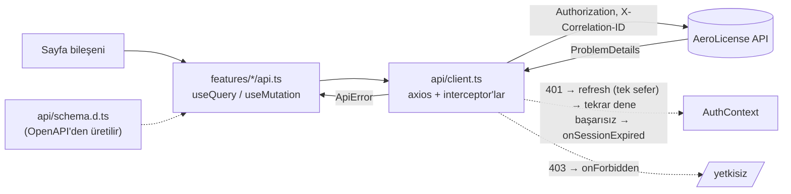

# AeroLicense Web (önyüz)

Kurgusal **Sivil Havacılık Otoritesi** için AeroLicense API'sinin React önyüzü: lisans başvurusu, denetçi
onayı, QR kodlu doğrulanabilir belge, eğitim ve uçuş kayıtları. Arayüz dili Türkçe; tüm metinler
[`src/i18n/tr.ts`](src/i18n/tr.ts) dosyasında.

> Tüm veriler kurgusaldır. Gerçek bir kurumun adı, logosu veya renk kimliği kullanılmaz.

**Teknoloji:** React 19 + TypeScript (strict) · Vite · React Router · TanStack Query · Axios ·
React Hook Form + Zod · MUI (açık/koyu tema) · openapi-typescript · Vitest + Testing Library + MSW

---

## 1. Ekranlar ve rol matrisi

| Ekran | Yol | Applicant | TrainingOrg | Inspector | Airline | Girişsiz |
|---|---|:-:|:-:|:-:|:-:|:-:|
| Giriş | `/login` | | | | | ✔ |
| Belge doğrulama | `/verify/:code?` | ✔ | ✔ | ✔ | ✔ | ✔ |
| Panel (lisans, uçuş saati, son başvurular) | `/dashboard` | ✔ | | | | |
| Başvurularım | `/applications` | ✔ | | | | |
| Yeni başvuru (3 adım: bilgiler → eğitim kontrolü → özet) | `/applications/new` | ✔ | | | | |
| Başvuru detayı + zaman çizelgesi | `/applications/:id` | ✔ | | | | |
| Eğitimlerim | `/trainings` | ✔ | | | | |
| Uçuş özetim (grafik) | `/flight-summary` | ✔ | | | | |
| Lisans belgem (QR + yazdır) | `/licenses` | ✔ | | | | |
| Eğitim kayıtları (filtre) | `/training-records` | | ✔ | | | |
| Sonuç gir (70 altı uyarısı) | `/training-records/new` | | ✔ | | | |
| İnceleme kuyruğu (sayfalama, sıralama, filtre) | `/review` | | | ✔ | | |
| Başvuru detayı + karar (incelemeye al / onayla / reddet) + eğitimler + audit | `/review/:id` | | | ✔ | | |
| Uçuş kayıtları (şüpheli filtresi) | `/flight-logs` | | | ✔ | ✔ (sadece kendi) | |
| Uçuş kaydı gönder (idempotency demosu) | `/flight-logs/new` | | | | ✔ | |
| İz kayıtları | `/audit` | | | ✔ | | |

Menü ve route guard'lar **aynı tablodan** ([`src/app/access.ts`](src/app/access.ts)) beslenir, birbirinden ayrışamaz.

> ⚠️ **Asıl yetki kontrolü backend'dedir.** Önyüzdeki rol kontrolü sadece kullanıcı deneyimi içindir:
> kullanıcıya göremeyeceği menüyü göstermemek, açamayacağı sayfaya yönlendirmemek. JavaScript kullanıcının
> tarayıcısında çalışır; değiştirilebilir. Birisi guard'ı atlatsa bile API her istekte token'daki rolü ve
> kayıt sahipliğini kontrol eder ve 403/404 döner. Önyüzde "gizlenen" hiçbir veri, API'nin o kullanıcıya
> zaten vermediği veri değildir.

---

## 2. Kurulum

Gereksinim: Node.js 22 LTS, çalışan AeroLicense API (bkz. [kök README](../README.md)).

```bash
cd frontend
npm install
cp .env.example .env.development.local   # gerekirse API adresini değiştirin
npm run dev                              # http://localhost:5173
```

**5173 doluysa:** Vite `strictPort` ile başka porta kaymaz (CORS sadece 5173'e izinli; sessizce 5174'e
geçip her istekte CORS hatası vermesindense açıkça hata vermesi tercih edildi). Başka porta taşımak için
backend'i `Cors__AllowedOrigins__0=http://localhost:5174 Verification__PublicBaseUrl=http://localhost:5174/verify/`
ortam değişkenleriyle başlatıp önyüzü `npx vite --port 5174 --strictPort` ile açın (kök README, "Yerel geliştirme").

| Komut | Ne yapar |
|---|---|
| `npm run dev` | Geliştirme sunucusu (port 5173; backend CORS'u sadece bu origin'e izin verir) |
| `npm run build` | Tip denetimi + üretim paketi (`dist/`) |
| `npm test` | Birim/bileşen testleri (MSW ile, backend gerekmez) |
| `npm run test:smoke` | Gerçek backend'e karşı uçtan uca akış (aşağıya bakın) |
| `npm run lint` | ESLint (`dangerouslySetInnerHTML` ve `console.log` yasak) |
| `npm run gen:api` | `openapi.json` → `src/api/schema.d.ts` (tipler) |
| `npm run gen:api:live` | Aynısı, çalışan backend'in Swagger'ından |

### Ortam değişkenleri

| Değişken | Örnek | Açıklama |
|---|---|---|
| `VITE_API_BASE_URL` | `http://localhost:5272` | Backend kök adresi (sonuna `/api/v1` eklenir) |

`VITE_` ile başlayan her değer derlenen JavaScript'e **gömülür ve herkes tarafından okunabilir**. Bu yüzden
`.env` dosyalarında gizli anahtar, parola veya token **tutulmaz**; önyüzün bilmesi gereken bir sır yoktur.

### Test kullanıcıları

Parola: backend `.env` dosyasındaki `SEED_DEMO_PASSWORD`.

| E-posta | Rol | Açılış sayfası |
|---|---|---|
| `pilot1@aerolicense.test` | Applicant | Panel (taslak CPL başvurusu hazır: gönder → denetçiyle onayla) |
| `pilot3@aerolicense.test` | Applicant | Süresi dolmuş lisans; ATPL için başarılı eğitim yok (sihirbaz ilerletmez) |
| `inspector@aerolicense.test` | Inspector | İnceleme kuyruğu |
| `egitim1@aerolicense.test` | TrainingOrg | Eğitim kayıtları |
| `havayolu1@aerolicense.test` | Airline | Uçuş kaydı gönder |

### Backend'de önyüz için yapılan değişiklikler

| Değişiklik | Neden |
|---|---|
| Swagger şemasında null olamayan alanlar `required` | Üretilen tiplerde her alan `?: T \| null` olmasın |
| `GET /flight-logs` (+ `suspicious` filtresi) | Denetçi ve havayolu uçuş listeleri için endpoint yoktu |
| `license-applications`: `sortBy` / `sortDir` | İnceleme kuyruğunda sunucu tarafı sıralama |
| Başvuru DTO'su: `reviewerId`, `reviewStartedAtUtc`, `trainingRecordId` | Buton kuralları, zaman çizelgesi, kanıt eğitimi |
| `/auth/me`: `fullName`, `organizationName` | Üst çubuk |
| CORS `WithExposedHeaders`: `Idempotent-Replayed`, `Retry-After` | Tarayıcı JS'i, açıkça izin verilmeyen yanıt başlıklarını okuyamaz |
| `Verification:PublicBaseUrl` (Development) → `http://localhost:5173/verify/` | QR önyüzdeki doğrulama sayfasına gitsin |

**CORS:** `appsettings.Development.json` → `Cors:AllowedOrigins: ["http://localhost:5173"]`. Joker (`*`)
yok; sadece `GET`/`POST` ve gerekli başlıklar. Üretimde bu liste yalnızca önyüzün gerçek alan adını içerir.

---

## 3. Mimari

```
src/
  app/        router, provider'lar, tema, layout, route guard, erişim tablosu, Error Boundary
  api/        axios istemcisi + interceptor'lar, ÜRETİLEN tipler (schema.d.ts), ProblemDetails, query key'ler
  features/   auth · trainings · applications · flight-logs · documents · audit
              (her biri: api.ts = TanStack Query hook'ları + sayfalar + testler)
  components/ DataTable · StatusChip · ConfirmDialog · EmptyState · ErrorState · PageHeader · DefinitionList
  hooks/      useUrlQueryState (sayfa + filtre URL'de)
  utils/      format.ts (UTC → Europe/Istanbul, tr-TR)
  i18n/       tr.ts (tüm metinler)
test/         MSW sunucusu, render yardımcısı, gerçek backend smoke testleri
```



### Neden TanStack Query?

Sunucudan gelen veri **uygulamanın state'i değil, sunucunun önbelleğidir**. Redux ya da `useState` ile
tutmak; yükleniyor, hata, yeniden deneme, önbellek süresi, iptal ve tazeleme mantığını her ekranda
elle yazmak demek. TanStack Query bunları bildirimsel olarak veriyor:
- **Hiyerarşik query key'ler:** Başvuru onaylanınca `invalidateQueries(['applications'])` hem listeyi hem detayı tazeliyor.
- **Mutation sonrası önbelleği doğrudan güncelleme:** Dönen DTO `setQueryData` ile detaya yazılıyor, ekstra GET atılmıyor.
- **İptal:** `signal` ile sayfadan çıkılınca istek iptal ediliyor.
- **`keepPreviousData`:** Sayfa değiştirirken tablo boşalıp titremiyor.
- **Yeniden deneme politikası:** 4xx **asla** tekrar denenmiyor. Ağ hatası ve 5xx en fazla 2 kez deneniyor. Mutation'lar (POST) hiç otomatik denenmiyor, çünkü idempotent olmayan bir işlem iki kez yapılabilirdi.

### Neden feature bazlı klasör yapısı?

`components/`, `hooks/`, `services/` gibi **türe göre** bir yapıda, tek bir özelliği değiştirmek 5 klasöre
dokunmak demek. Feature bazlı yapıda "başvuru" ile ilgili her şey (API hook'ları, sayfalar, kurallar,
testler) `features/applications/` altında duruyor. Bir özellik silinirken ya da yeni ekibe devredilirken
sınır net. Sadece gerçekten ortak olanlar `components/` altında. Route'lar da feature bazlı lazy
yüklendiği için bu yapı kod bölmeyle doğal olarak örtüşüyor.

### Neden tipleri OpenAPI'den üretmek?

Elle yazılan tip, backend'in **bir zamanki halinin** kopyasıdır ve sessizce eskir. Backend bir alanı
yeniden adlandırdığında elle yazılmış tip derlemeden geçer, hata ancak çalışırken fark edilir.
`npm run gen:api` sonrası ise bozulan her kullanım **derleme hatası** verir. Bunun işlemesi için backend
şemasının doğru olması gerekiyordu. Swashbuckle varsayılan olarak hiçbir alanı `required` işaretlemiyor;
backend'e eklenen bir schema filter, C#'taki null olabilirliği şemaya birebir yansıtıyor. Enum'lar da
şemadan geliyor ve `Record<ApplicationStatus, …>` eşlemeleri yeni bir durum eklendiğinde derleme hatası
veriyor. Orval yerine openapi-typescript seçildi: sadece tip üretiyor, hook üretmiyor. Böylece TanStack Query
kodu elle yazılmış, okunabilir ve açıklanabilir kalıyor.

### Token saklama tercihi

**Prototipte:** Access ve refresh token **sadece bellekte** tutuluyor (`api/client.ts` modül değişkeni);
`localStorage` ya da `sessionStorage` kullanılmıyor. Sayfa yenilenince oturum düşüyor; bu bilinçli bir ödünleşim.
Access token 15 dakikada dolduğunda interceptor refresh token ile **sessizce yeniliyor**. Aynı anda 401
alan 5 istek **tek bir** refresh isteğini bekliyor (single-flight). Aksi halde 5 paralel refresh olur ve
backend'in "tekrar kullanım tespiti" bunu çalınmış token sanıp oturumu tamamen kapatırdı.

**Neden localStorage değil?** Sayfada çalışan **her** JavaScript `localStorage`'ı okuyabilir. Tek bir XSS
açığı ya da ele geçirilmiş bir npm bağımlılığı, token'ı saldırganın sunucusuna gönderebilir ve saldırgan
oturumu kendi makinesinden, istediği zaman kullanır. Bellekteki token'a erişim daha zordur ve sekme
kapanınca yok olur. Yine de XSS **olan** bir sayfada saldırgan kullanıcının adına istek atabilir; bu
yüzden asıl savunma XSS'i önlemek: `dangerouslySetInnerHTML` lint ile yasak, React varsayılan olarak
kaçışlıyor, kullanıcı girdisi HTML olarak basılmıyor.

**Üretim önerisi (BFF + httpOnly cookie):**
1. Refresh token (hatta oturumun tamamı) `HttpOnly; Secure; SameSite=Strict; Path=/api/auth` cookie'de tutulur. JavaScript bu cookie'yi **hiç okuyamaz**; XSS ile çalınamaz.
2. Access token ya bellekte kalır ya da hiç tarayıcıya gelmez: bir BFF (Backend-for-Frontend) oturum cookie'sini API çağrısında bearer token'a çevirir.
3. Cookie tabanlı oturumda CSRF'e karşı `SameSite=Strict` + anti-forgery token + `Origin` başlığı kontrolü uygulanır.
4. Sayfa yenilenince uygulama açılışta `POST /auth/refresh` çağırır (cookie otomatik gider) ve oturum geri gelir.
5. Kurum personeli için e-Devlet / kurumsal IdP ile OIDC Authorization Code + PKCE akışı kullanılır; parola bu uygulamaya hiç girmez.

---

## 4. Uygulanan iyi pratikler

| Konu | Nasıl |
|---|---|
| Hata yönetimi | `api/problem.ts`, backend ProblemDetails'ini `ApiError`'a çeviriyor. 400 alan hataları `applyFieldErrors` ile ilgili form alanına yazılıyor (`"Reason"` → `reason`). 4xx'te backend'in Türkçe mesajı gösteriliyor, 5xx ve ağ hatasında genel mesaj + **destek kodu** (correlation ID). Teknik detay gösterilmiyor. |
| Durumlar | Her liste ve sayfada yükleniyor (iskelet), boş ve hata (tekrar dene) durumları `DataTable` / `ErrorState` / `EmptyState` içinde tek yerde |
| Error Boundary | Global (`app/ErrorBoundary.tsx`) + router seviyesinde `errorElement` (örneğin yeni yayından sonra eski bir chunk'ın bulunamaması) |
| Çift gönderim | Gönderim sırasında butonlar pasif. Onay diyaloğu işlem sürerken kapatılamıyor. Havayolu formunda idempotency anahtarı |
| URL durumu | Sayfa, sayfa boyutu, filtre ve sıralama URL'de (`useUrlQueryState`); yenileme, geri tuşu ve paylaşılan bağlantı aynı listeyi gösteriyor. Filtre değişince sayfa 1'e dönüyor. URL'den gelen değerler doğrulanıyor. |
| Tarih ve saat | Backend UTC dönüyor; gösterim her zaman `Europe/Istanbul` + `tr-TR`, tarayıcının saat dilimine bakılmıyor. Girişte "Türkiye saati" UTC+3 olarak yorumlanıp UTC'ye çevriliyor (Türkiye 2016'dan beri sabit +03:00). |
| Erişilebilirlik | Tüm form alanları etiketli. "İçeriğe geç" bağlantısı var. Belirgin odak halkası. Sayfa başına tek `<h1>`. Durum rozetlerinde renk + metin. Tablo `caption`. Pasif butonun nedeni görünür metin olarak yazılıyor. Sihirbazda adım değişince odak başlığa taşınıyor. Sonuçlar `aria-live` ile duyuruluyor. Kontrast WCAG AA. |
| Responsive | Masaüstünde sabit menü, mobilde açılır menü. Tablolarda ikincil kolonlar mobilde gizleniyor. Formlar tek kolona iniyor. |
| Güvenlik | `dangerouslySetInnerHTML` ESLint ile yasak. `console.log` yasak, böylece token yanlışlıkla loglanamıyor. `.env` dosyasında sır yok. Üretimde source map yayınlanmıyor. `referrer` politikası `no-referrer` (doğrulama kodu başka sitelere sızmıyor). |
| KVKK | TC kimlik no ve e-posta backend'den **maskeli** geliyor (`999******01`, `p***@…`); önyüz açık değeri hiç görmüyor. Havayolu listesinde pilot adı yok. Doğrulama sayfası sadece minimum bilgiyi gösteriyor. |
| Kod bölme | Her rol sayfası `React.lazy` ile ayrı chunk. React, MUI ve veri kütüphaneleri ayrı vendor chunk'larında (uzun süreli önbellek). Uygulama kodu ~11 KB (gzip). |

---

## 5. Testler

| Dosya | Kapsam |
|---|---|
| `features/auth/LoginPage.test.tsx` | Boş/hatalı alan validasyonu (API çağrılmaz), başarılı girişte Authorization başlığı ve rol yönlendirmesi, 401 mesajı |
| `app/RequireRole.test.tsx` | Girişsiz → login (dönüş adresiyle), yanlış rol → `/yetkisiz`, menüde sadece rolün sayfaları |
| `features/applications/ReviewActions.test.tsx` | Durum ve denetçiye göre İncelemeye al / Onayla / Reddet aktif-pasif; **ret gerekçesi zorunlu** (boş ve kısa gerekçede API çağrılmaz); backend alan hatası forma yansır |
| `features/applications/ApplicationDetailPage.test.tsx` | Taslak gönderimi + bildirim (regresyon), ret gerekçesinin HTML olarak yorumlanmaması |
| `features/documents/VerifyPage.test.tsx` | Geçerli / değiştirilmiş (içerik gösterilmez) / süresi dolmuş / iptal / bulunamadı / bozuk kod (API çağrılmaz) |
| `features/flight-logs/AirlineSubmitForm.test.tsx` | Tekrar gönderimde **aynı** Idempotency-Key, "yeni kayıt oluşmadı" gösterimi, istemci validasyonu |
| `api/problem.test.ts`, `utils/format.test.ts` | ProblemDetails eşleme, 5xx'te detay gizleme, UTC ↔ Türkiye saati |
| `test/smoke/flows.smoke.tsx` | **Gerçek backend:** pilot gönderir → denetçi onaylar → QR → girişsiz doğrulama "Geçerli"; havayolu tekrar gönderimi; şüpheli filtre; audit; eğitim kaydı |

Bileşen testlerinde **MSW** kullanılıyor: axios mock'lanmıyor, ağ yanıtı taklit ediliyor. Böylece interceptor'lar,
başlıklar ve hata dönüştürme de teste dahil. Tanımsız bir istek gelirse test başarısız oluyor, yani sessizce
gerçek ağa çıkılmıyor.

**Smoke test:** Gerçek route ağacını jsdom içinde `http://localhost:5173` origin'iyle çalıştırıp gerçek API'ye bağlanıyor.
jsdom CORS kurallarını uyguladığı için backend'in CORS ve exposed-header ayarlarını da sınıyor. Bu test gerçek bir
hata yakaladı: taslak gönderildikten sonra "Gönder" butonu ekrandan kalktığı için TanStack Query'nin `mutate(…, { onSuccess })`
callback'i hiç çalışmıyor, kullanıcı başarı bildirimini görmüyordu. Çözüm `mutateAsync` oldu; MSW regresyon testi de eklendi.

```bash
# backend, smoke için yükseltilmiş login limitiyle (testler 5'ten fazla giriş yapar):
RateLimiting__LoginPermitPerMinute=100 dotnet run --project src/AeroLicense.Api --launch-profile http
SMOKE_PASSWORD='<SEED_DEMO_PASSWORD>' npm run test:smoke
```

Smoke test veritabanını değiştirir; temiz bir demo için veritabanını silip API'yi yeniden başlatın (seed tekrar kurulur).

---

## 6. Mülakat notları: 8 önemli teknik karar

1. **Sunucu durumu = TanStack Query, istemci durumu = React state.** Global store (Redux) yok, çünkü paylaşılan
   verinin neredeyse tamamı sunucudan geliyor. Önbellek, tazeleme ve yeniden deneme bildirimsel yapılıyor.
   Mutation'lar otomatik tekrar denenmiyor, 4xx hataları da tekrar denenmiyor.
2. **Tipler OpenAPI'den üretiliyor, backend şeması düzeltildi.** Sözleşme tek kaynaktan geliyor. Backend
   değişince önyüz çalışma anında değil **derleme anında** kırılıyor. `required` işaretleri backend'de bir
   schema filter ile doğru hale getirildi.
3. **Tek HTTP istemcisi, interceptor'lar.** Authorization, correlation ID, 401'de tek seferlik (single-flight)
   refresh, 403 yönlendirmesi ve ProblemDetails → `ApiError` dönüşümü tek yerde. Bileşenler Axios'u bilmiyor.
4. **Token bellekte; üretimde httpOnly cookie + BFF.** `localStorage` XSS ile okunabilir. Prototipte sayfa
   yenilenince oturumun düşmesi kabul edildi; üretim yolu README'de anlatıldı.
5. **Yetki backend'de, önyüzde sadece UX.** Route guard ve menü aynı erişim tablosundan geliyor. Buton kuralları
   (`availableActions`) backend'deki durum makinesinin yansıması ve saf fonksiyon olarak test ediliyor.
6. **Sunucu tarafı sayfalama ve sıralama, durum URL'de.** İstemci tarafı sıralama sadece mevcut sayfayı
   sıralardı (yanlış sonuç). URL'de tutulan durum yenileme, geri tuşu ve paylaşılan bağlantıyla korunuyor.
7. **Idempotency anahtarı mantıksal işlem başına.** Anahtar form açılınca üretiliyor, her tıklamada değil.
   Aynı işlemin tekrarı aynı anahtarla gidiyor ve backend ikinci kaydı oluşturmuyor. "Yeni kayıt" yeni bir anahtar üretiyor.
8. **Test piramidi: saf fonksiyon → MSW'li bileşen → gerçek backend smoke.** MSW HTTP katmanını da test ediyor.
   Smoke test CORS'u sınıyor ve MSW'nin yakalayamadığı gerçek bir unmount hatasını buldu.

**Bilinçli olarak kapsam dışı:** kamera ile QR okuma (doğrulama sayfası QR'ın içerdiği URL ile zaten açılıyor;
kamera için `BarcodeDetector` ya da bir kütüphane eklenebilir), ikinci dil, Playwright ile gerçek tarayıcı testleri
(smoke test jsdom'da; görsel ve gerçek tarayıcı davranışı için bir sonraki adım Playwright).
